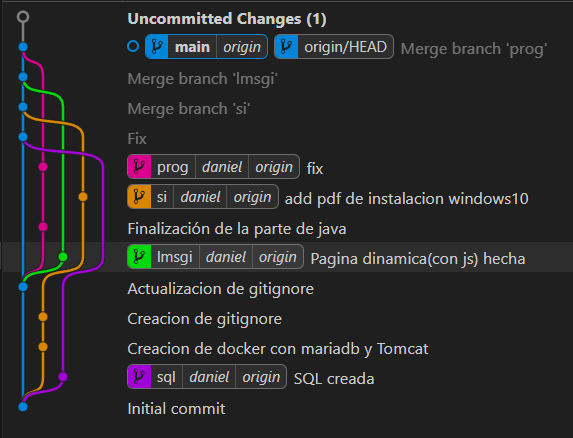

# Proyecto Indra

Este repositorio contiene el desarrollo de un proyecto que hemos realizado en la empresa Indra, abarcando varias asignaturas del ciclo formativo:

## Estructura del Proyecto

- **doc/**  
  Documentación y archivos relacionados con la asignatura de **Sistemas Informáticos**.  
  Aquí se encuentra el archivo `compose.yml` para la gestión de contenedores Docker.

- **html/**  
  Archivos HTML y recursos asociados, desarrollados en la asignatura de **Lenguajes de Marca**.

- **ProyectoEstatico/**  
  Código fuente y recursos del proyecto estático, correspondiente a la asignatura de **Programación**.

- **sql/**  
  Scripts y archivos relacionados con la **Base de Datos**.

## Creación de Ramas

El desarrollo se ha gestionado mediante ramas en Git para separar las distintas partes del proyecto y facilitar el trabajo colaborativo.  
A continuación, se muestra una imagen representativa del entorno de desarrollo y la creación de ramas:

## Resumen por Asignatura

- **Sistemas Informáticos:**  
  - Configuración de servicios y contenedores en `doc/compose.yml`.
  - Documentación técnica y manuales de despliegue.

- **Lenguajes de Marca:**  
  - Desarrollo de la estructura web en HTML en la carpeta `html/`.

- **Programación:**  
  - Implementación de la lógica y recursos estáticos en `ProyectoEstatico/`.

- **Base de Datos:**  
  - Creación y gestión de la base de datos en la carpeta `sql/`.

---

